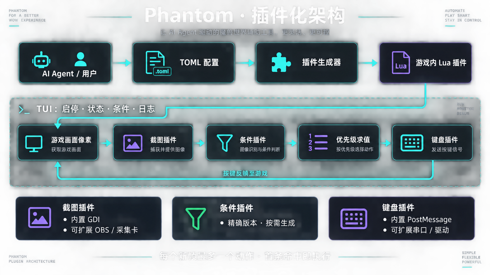
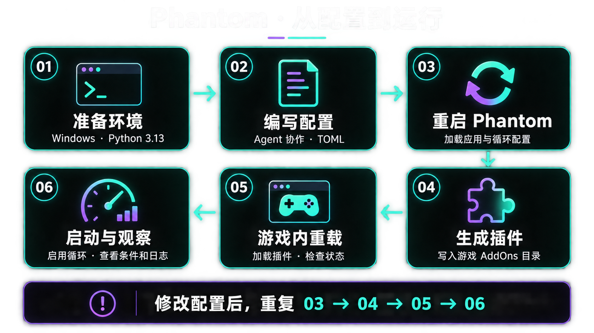

# Phantom

**面向 AI Agent 协作环境的魔兽世界辅助工具。**

迎接 AI 时代，把你的循环思路写成可阅读、可修改、可追溯的配置：你描述需求，Agent 阅读项目 skills、编写 TOML、开发插件；Phantom 负责在本地采集画面、解析条件、按优先级执行宏。

项目面向 Windows 与魔兽世界正式服，当前开发目标为 12.1 系列。运行时由本地规则引擎决策，使用已有配置运行不需要连接大模型。Agent 主要参与配置和开发，实际效果取决于游戏版本、插件能力与循环规则。

## 特点

| 能力 | 说明 |
| --- | --- |
| 终端界面（TUI） | 基于 Textual 的中文深色界面，集中管理启停、插件生成、游戏状态、条件值和业务日志，支持键盘与鼠标操作。 |
| 条件插件化 | 在独立目录实现新条件，即可扩展技能、资源、光环等判断；遵循现有接口时，无需修改核心代码。 |
| 截图引擎插件化 | 当前内置 `gdi@dev`。可以按截图接口开发 OBS、采集卡等输入插件，并通过配置选择。 |
| 输出引擎插件化 | 当前内置 `post_message@dev`。可以按键盘接口扩展串口模拟键盘或其他驱动输出。 |
| 面向 Agent 的 TOML | 应用配置、rotation 和插件自述均使用 TOML；稳定字段名配合中文说明，便于 Agent 读取、修改，也便于人工审阅。 |
| 精确插件版本 | 配置使用 `包名@版本` 引用插件，不自动升级或替换；多个版本可以并存。 |
| 多专精配置 | 多份 rotation 共同生成一个游戏插件，运行时根据画面中的职业、专精选择对应循环。 |

OBS、采集卡、串口及其他驱动属于可扩展方向，仓库目前未附带这些后端。仓库提供 13 个职业、40 个专精的 rotation，适合作为修改起点；其中 38 份保留[辅助循环 TXT 转换](.agents/skills/phantom-rotation-dev/references/assisted-rotations.md)，鲜血死亡骑士与防护圣骑士采用[用户确认的 Shigure JSON 迁移策略](.agents/skills/phantom-shigure-migration/references/confirmed-tank-migration.md)。这些配置含近似映射和固定量程，不能等同于所有天赋与场景下的最优循环。

## 工作原理



1. **生成**：读取 rotation 与条件插件，生成游戏内 Lua 插件、像素布局及宏绑定。
2. **呈现**：游戏插件把所需状态呈现在画面角落的像素区域。
3. **采集**：截图插件提供图像，条件插件把像素解析为布尔值、数值或列表。
4. **决策**：循环规则从上到下求值，首条命中即决定本帧动作。
5. **输出**：键盘插件发送已分配的宏键位；每个新帧最多执行一个动作，命中 `Idle` 或没有动作时不发键。

TUI 展示与后台使用同一帧的条件和决策，方便检查“当前为什么执行这个宏”。配图为 AI 生成的说明图，具体行为以正文和代码为准。

## 快速开始



### 1. 准备环境并安装

需要 Windows、Python **3.13**、Git，以及已安装的魔兽世界正式服。以下命令在 PowerShell 中执行；终端建议至少 **120 列 × 46 行**。

```powershell
git clone --branch main https://github.com/liantian-cn/Phantom.git
cd Phantom
py -3.13 -m venv .venv
.venv/Scripts/python -m pip install -r requirements.txt
.venv/Scripts/python -m phantom.main
```

请始终从项目根目录启动。首次运行会在**当前工作目录**创建 `phantom.toml`，并扫描同级 `rotations/` 下的配置。程序默认暂停，先用 `Ctrl+Q` 退出并完成下一步配置。

### 2. 配置游戏路径与引擎

编辑刚生成的 `phantom.toml`。以下是应用配置示例；将游戏路径替换为自己的实际路径，并修改已有表，避免重复添加同名表。

```toml
[capture]
plugin = "gdi@dev"
fps = 15

[keyboard]
plugin = "post_message@dev"

[ui]
min_width = 120
min_height = 46
log_max_lines = 1000

[wow]
executable = 'D:\World of Warcraft\_retail_\Wow.exe'

[addon]
name = "Phantom"

[rotations]
"deathknight.blood" = "rotations/死亡骑士-鲜血.toml"
```

路径必须指向现存的 `_retail_/Wow.exe`。Windows 路径可以使用 TOML 单引号字符串，避免反斜杠转义。rotation 相对路径以 `phantom.toml` 所在目录为基准。

每个职业专精组合最多选择一份 rotation。未指定或选择失效的组合会从 `rotations/*.toml` 自动寻找有效配置，并回写选择结果；上面的单条映射并不表示禁用其余专精。配置只在启动时读取，编辑后需要重启。

### 3. 生成并加载游戏插件

重新运行 `.venv/Scripts/python -m phantom.main`，在“综合”页点击“生成插件”。程序把本次启动已加载的 rotation 共同生成到：

```text
你的游戏目录/_retail_/Interface/AddOns/Phantom/
```

目录名来自 `addon.name`。每次生成会替换该插件目录的全部内容，因此不要在生成目录保存手工文件。首次安装后在游戏插件列表启用插件；如果游戏尚未识别新插件，退出并重新进入游戏。后续重新生成后，在游戏中执行 `/reload`。

### 4. 启动、观察与停止

进入角色后，确认游戏插件的像素区域可见且未被其他窗口遮挡。默认 GDI 后端读取桌面画面；当前 PostMessage 后端要求恰好一个标题为“魔兽世界”的窗口。

在 TUI 点击“启动”开始采集与循环处理；使用仓库自带 rotation 时，还需在游戏内控制条启用循环。到“循环条件”页观察条件返回值、命中规则和宏，到“日志”页查看问题。TUI 的“关闭”停止采集与执行，`Ctrl+Q` 退出程序。

| 操作 | 方法 |
| --- | --- |
| 切换标签页 | `Tab` / `Shift+Tab` |
| 选择操作按钮 | `↑` / `↓` |
| 执行所选操作 | `Enter` / `Space`，或鼠标点击 |
| 退出 | `Ctrl+Q` |

宏键位按声明顺序自动分配，并在游戏运行期间覆盖相应键位的原有动作。修改应用配置或 rotation 后，按“停止 → 退出并重启 → 生成插件 → 游戏内重载 → 启动”的顺序操作。切换专精后也需要重载游戏界面，建议先停止 TUI 执行，再完成重载和检查。

### 常见问题

| 现象 | 检查方法 |
| --- | --- |
| “启动”不可用 | 确认正式服 `Wow.exe` 正在运行，且其直接父目录为 `_retail_`；查看游戏检测提示。 |
| “生成插件”不可用 | 确认游戏路径有效、至少一份 rotation 加载成功，并且已经停止采集。 |
| 找不到画布或采集失败 | 确认生成的插件已启用、游戏已重载、像素区域可见；按界面提示排查。 |
| 有数据但没有动作 | 检查当前专精是否匹配、启用条件是否成立、首条命中是否为 `Idle`，以及规则优先级。 |
| 按键发送后暂停 | 检查日志；默认输出后端需要唯一的“魔兽世界”窗口。修复原因后手动启动。 |
| 修改配置没有生效 | 退出重启后重新生成，再在游戏内重载；运行中不会热加载文件。 |

## Rotation 文件格式

`phantom.toml` 决定应用如何运行，`rotations/*.toml` 决定循环如何选择动作。一份 rotation 的主要部分如下：

| 字段 | 用途 |
| --- | --- |
| `schema_version`、`uuid` | 当前格式版本为 `1`，UUID 标识这一份配置。 |
| `[profile]` | 中文标题、说明、职业 token 和专精顺序索引。 |
| `[[conditions]]` | 条件标题、精确插件标识及可选的 `[conditions.plugin_args]` 参数。 |
| `[[macros]]` | 宏名称 `name` 和非空宏文本 `macro_text`。 |
| `[[rotation]]` | 条件表达式 `condition`、动作 `macro` 和可选说明 `annotate`，按出现顺序执行。 |

下面是一份完整的**格式教学示例**，只用于说明启用条件、目标判断、宏和优先级，不是实战循环：

```toml
schema_version = 1
uuid = "a02852f8-2dc0-4cec-82d9-b5be1ae83e4a"

[profile]
title = "战士武器格式示例"
description = "启用且存在目标时尝试开始普通攻击。"
unit_class = "WARRIOR"
unit_spec = 1

[[conditions]]
title = "插件启用"
plugin = "enable@dev"

[[conditions]]
title = "目标存在"
plugin = "target_is_exists@dev"

[[macros]]
name = "开始攻击"
macro_text = "/startattack"

[[rotation]]
condition = "not 插件启用"
macro = "Idle"
annotate = "未启用时，本帧不执行动作"

[[rotation]]
condition = "目标存在"
macro = "开始攻击"

[[rotation]]
condition = ""
macro = "Idle"
annotate = "末尾兜底"
```

条件标题可以使用中文，需符合标识符规则，不能包含空格、括号或运算符；表达式引用必须与标题一致。`unit_spec` 是职业内的专精顺序索引，不是全局专精 ID，具体组合可参照现有配置。

表达式支持比较、`and` / `or` / `not`、`in` / `not in` 和括号；表达式中的布尔常量写作 `True` / `False`，TOML 参数布尔值则写作 `true` / `false`。不支持函数调用、属性访问或算术运算。

规则**从上到下首条命中**。`Idle` 是保留动作，不需要声明宏；空条件只允许用于末尾 `Idle`。启用、爆发和延迟都必须显式声明条件并写入规则，不会由框架自动附加。宏无需填写 `key` 或 `bind_key`，最多声明 148 个宏。插件参数以对应版本的说明和实现为准，加载成功后可能补写缺失的默认参数。

完整语法见 [rotation 配置规范](.agents/skills/phantom-rotation-dev/references/configuration.md)，条件能力见[内置条件目录](.agents/skills/phantom-plugin-dev/references/built-in-conditions.md)。

## 与 Agent 一起开发

仓库的 [AGENTS.md](AGENTS.md) 是协作入口，`.agents/skills/` 保存项目专用 skills。Skill 是供 Agent 阅读的任务指南和参考索引，帮助它按需了解代码、契约和验证方法。

| 任务 | 使用的 skill |
| --- | --- |
| 编写循环、组合条件、调整优先级 | [phantom-rotation-dev](.agents/skills/phantom-rotation-dev/SKILL.md) |
| 将 Shigure JSON 与技能 Lua 迁移为 Phantom 循环 | [Shigure迁移工具](.agents/skills/phantom-shigure-migration/SKILL.md) |
| 增加条件、截图或键盘插件 | [phantom-plugin-dev](.agents/skills/phantom-plugin-dev/SKILL.md) |
| 修改 TUI、核心引擎、生成器或像素协议 | [phantom-code-dev](.agents/skills/phantom-code-dev/SKILL.md) |
| 核验 WoW API、事件和调用限制 | [phantom-wow-api](.agents/skills/phantom-wow-api/SKILL.md) |

在项目目录打开支持读取仓库文件的 Agent，让它先读取 `AGENTS.md`，再按任务读取相应 `SKILL.md`。开发请切换到 `develop`；该分支保留测试、演示及开发辅助文件。

### 开发自己的 rotation

先明确职业专精、场景、技能优先级与宏文本，再从相近配置建立新文件并生成新的 UUID。让 Agent 核对每个条件插件的实际参数与返回值，补齐启用、爆发等门控，最后更新 `phantom.toml` 中对应组合的路径。

可以把下面的需求交给 Agent，并替换方括号中的内容：

> 请读取 AGENTS.md，使用 phantom-rotation-dev，为 [职业与专精] 编写 [场景] 的 rotation。技能优先级是 [顺序]，爆发策略是 [策略]，宏文本是 [文本]。先核对内置插件，缺少能力时说明缺口。请在临时副本中校验配置并在内存中生成 Lua，报告尚未完成的游戏内验证。

离线校验应操作临时副本：`load_rotation()` 成功后可能回写插件默认参数。配置和生成检查通过后，再由使用者在游戏内检查条件、键位和实际表现。

### 迁移 Shigure 循环

向 Agent 提供源 JSON、对应技能 Lua 和希望保留或调整的策略，使用 [Shigure迁移工具](.agents/skills/phantom-shigure-migration/SKILL.md)。它按源 `Rules` 顺序盘点条件、单位、别名和宏，先复用 Phantom 现有插件，报告语义缺口及优先级疑点，再按确认结果迁移并离线验证。默认依靠用户输入与 skill 中的经验完成；未覆盖语义先报告，只有另获授权才查阅外部 Shigure 源码。

### 用插件强化 Phantom

在现有契约覆盖的范围内，新能力可以放在独立版本目录，通过配置接入：

```text
phantom/
  conditions/你的条件名@dev/
    condition.py     # 导出 Plugin：参数、返回值与解码
    template.lua     # 可选：游戏端状态呈现
    plugin.toml      # 中文用途、参数、返回值和版本说明
  captures/你的截图名@dev/
    capture.py       # 导出 Plugin：采集生命周期与图像
    plugin.toml
  keyboards/你的输出名@dev/
    keyboard.py      # 导出 Plugin：组合键发送与资源释放
    plugin.toml
```

例如：“使用 phantom-plugin-dev 开发一个 OBS 截图插件，先核对截图 worker 的图像格式、帧序号和启停契约，再实现并验证。”同样可以开发新的条件或串口键盘插件。具体设备连接、参数与依赖由插件实现确定。

`plugin.toml` 是提供给人和 Agent 的说明，运行时实际加载 Python 入口。正式数字版本不原地修改接口或逻辑，行为变更应建立新版本；`@dev` 为可调整的开发版本。涉及新的 WoW 调用时，追加 API 核验；涉及核心契约时，再进入核心开发流程。

## 分支与对外同步

`develop` 用于完整开发，`main` 提供对外分享的文件快照。每次推送 `develop`，触发工作流通知 `main` 上的同步工作流，后者从最新 `develop` 生成提交，排除以下根目录项目：

- `.opencode/`
- `.script/`
- `demo/`
- `tests/`
- `phantom.toml`

这些文件在 `develop` 保留。同步保留 `main` 自身的同步工作流，不强制推送，也不合并开发历史；首次使用者的应用配置由程序生成。维护者可在 GitHub Actions 中从 `main` 手动运行同步，结果以 Actions 日志为准。

## 免责声明 (Disclaimer)

1. **合规责任**

   Phantom 仅供技术研究、学习交流和个人实验使用。下载、安装、复制、修改、分发或使用本软件前，用户应自行确认相关行为符合所在地法律法规，以及目标软件、游戏平台或服务提供商的用户协议、服务条款和社区规则。

2. **账号与处罚风险**

   本软件可能涉及窗口状态读取、按键发送或自动化辅助流程。此类行为可能被游戏运营商、反作弊系统或相关服务提供商认定为违规，并导致账号限制、角色封禁、数据丢失、收益回收或其他处罚。用户应充分了解并自行承担全部风险，开发者不对由此产生的任何后果负责。

3. **无担保声明**

   本项目基于 MIT License 开源发布，详见 [LICENSE](LICENSE)。软件按“原样”（AS IS）提供，不对稳定性、准确性、完整性、安全性、兼容性、持续可用性或特定用途适用性作出任何明示或暗示保证。因使用或无法使用本软件导致的直接、间接、偶然、特殊或后续损失，均由用户自行承担。

4. **商业使用与衍生版本**

   MIT License 允许在遵守许可证条件的前提下复制、修改、分发和商业使用本软件。任何第三方对本软件或其衍生版本的运营、销售、推广、技术支持或其他商业利用，均由该第三方独立负责。开发者不代表、不授权或保证任何第三方产品、服务或运营活动，也不对第三方的违法行为、违反平台规则的行为或由此产生的后果负责。
   但本声明不限制适用法律所规定的责任，也不构成对任何具体行为合法性的保证。

5. **使用即表示接受**

   使用者应在使用前阅读并理解本免责声明及 MIT License。开始使用本软件，表示使用者已获得必要授权，并将自行承担使用本软件产生的风险；但仅通过使用行为是否构成法律上的合同接受，应以适用法律及实际使用场景为准。
